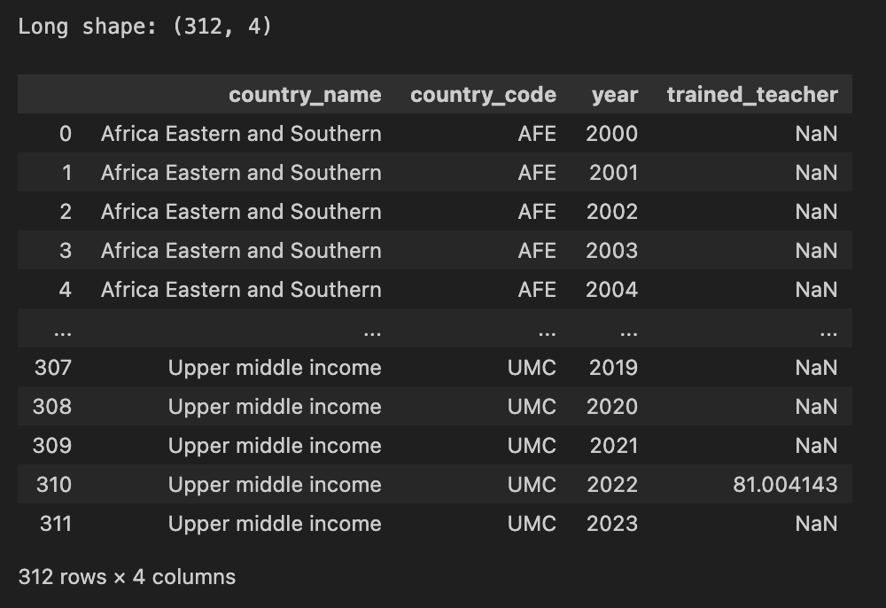
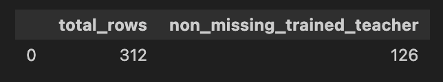
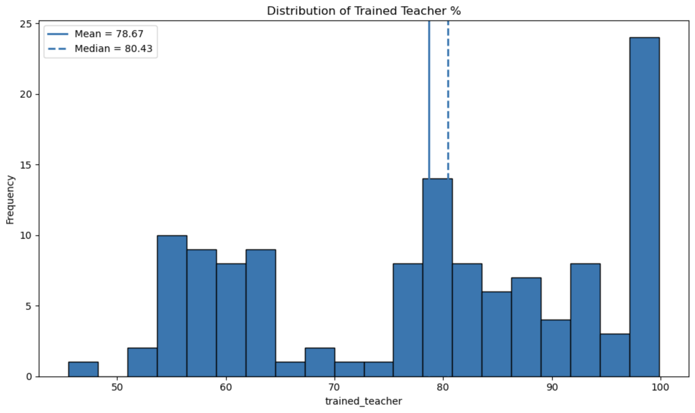
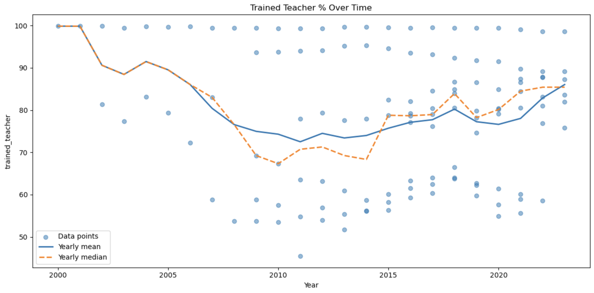

# Introduction to Our Project
This project examines global education patterns using data from the World Bank’s World Development Indicators (WDI), with a focus on school enrollment across primary, secondary, and tertiary levels. Rather than analyzing individual countries, the study compares aggregated regional and income-based groupings provided by the World Bank, allowing for a broader and more structured analysis of global education systems. The analysis includes gender-disaggregated enrollment data and measures of trained teachers to provide a multidimensional view of education.

Education is a key driver of economic development, human capital formation, and long-term growth. While enrollment rates provide an important measure of access to schooling, they do not fully capture the effectiveness or equity of education systems. Gender differences in enrollment can reveal persistent inequalities in access, while the proportion of trained teachers reflects the quality of education systems. Examining these factors across both regional and income-based groupings allows for a more systematic understanding of how development levels relate to enrollment.

This analysis is guided by two primary research questions. First, how do male and female enrollment rates differ across global regions and income groups from 2000 to 2020, and how do these differences vary across levels of education? Second, how does the proportion of trained teachers in secondary education vary across these groupings, and what patterns emerge when comparing teacher preparedness with enrollment levels?

To address these questions, we construct a dataset from multiple WDI education indicators and apply a series of data cleaning and preprocessing steps to ensure consistency across regions, income groups, and years. 


# Data Description

The dataset used in this project is drawn from the World Bank’s World Development Indicators (WDI), which contains over 1,600 indicators across more than 200 countries and territories from 1960 to 2023. In addition to country-level data, the WDI provides pre-aggregated indicators for regional groupings (e.g., East Asia & Pacific, Europe & Central Asia) and income-based groupings. This project focuses on these aggregated regional and income categories rather than individual countries.

The analysis uses a subset of education-related indicators, including school enrollment rates at the primary, secondary, and tertiary levels, gender-disaggregated enrollment measures, and the proportion of trained teachers. These indicators are selected to capture key dimensions of education systems, including access to schooling, equity across gender, and the quality of instruction.

To ensure consistency and comparability, the dataset is restricted to selected regional and income groupings and to the time period from 2000 to 2020. This time window is chosen to maximize data availability across all variables, particularly for trained teacher indicators, which are less consistently reported in earlier years.

<<<<<<< HEAD

## Code for Data Cleaning Enrollment Data
```{sql}

```

## Code for Data Cleaning Trained Teacher Data
```{sql}
import pandas as pd
   # Secondary Female


regions = [
import pandas as pd


df_female = pd.read_csv(
   "data/raw/enrollment/SECONDARY_Female_School_Enrollment_DATA.csv",
   skiprows=4
)


df_female.to_sql(
   "secondary_female_raw",
   conn,
   if_exists="replace",
   index=False
)
pd.read_sql("SELECT COUNT(*) FROM secondary_female_raw;", conn)


import sqlite3
conn = sqlite3.connect("data/education.db")


cursor = conn.execute("""
SELECT name FROM sqlite_master WHERE type='table';
""")


cursor.fetchall()


conn.executescript("""
CREATE TABLE secondary_female_clean AS
SELECT
   "Country Name" AS country_name,
   "Country Code" AS country_code,
   "Indicator Name" AS indicator_name,


   "2000","2001","2002","2003","2004","2005","2006","2007","2008","2009",
   "2010","2011","2012","2013","2014","2015","2016","2017","2018","2019",
   "2020","2021","2022","2023"


FROM secondary_female_raw


WHERE "Country Code" IN (
'AFE','AFW','ARB','AUS','EAS','EUU','LCN','NAC','SAS',
'LIC','LMC','UMC','HIC'
);
""")


pd.read_sql("SELECT COUNT(*) FROM secondary_female_clean;", conn)


import pandas as pd


df_male = pd.read_csv(
   "data/raw/enrollment/SECONDARY_Male_School_Enrollment_DATA.csv",
   skiprows=4
)


df_male.head()


df_male_clean = df_male[
   ["Country Name", "Country Code", "Indicator Name",
    "2000","2001","2002","2003","2004","2005","2006","2007","2008","2009",
    "2010","2011","2012","2013","2014","2015","2016","2017","2018","2019",
    "2020","2021","2022","2023"]
]


df_male_clean = df_male_clean.dropna(how="all", subset=[
   "2000","2001","2002","2003","2004","2005","2006","2007","2008","2009",
   "2010","2011","2012","2013","2014","2015","2016","2017","2018","2019",
   "2020","2021","2022","2023"
])


df_male_clean.to_sql(
   "secondary_male_raw",
   conn,
   if_exists="replace",
   index=False
)


conn.executescript("""
DROP TABLE IF EXISTS secondary_male_clean;


CREATE TABLE secondary_male_clean AS
SELECT
   "Country Name" AS country_name,
   TRIM("Country Code") AS country_code,
   "Indicator Name" AS indicator_name,


   "2000","2001","2002","2003","2004","2005","2006","2007","2008","2009",
   "2010","2011","2012","2013","2014","2015","2016","2017","2018","2019",
   "2020","2021","2022","2023"


FROM secondary_male_raw
WHERE TRIM("Country Code") IN (
'AFE','AFW','ARB','AUS','EAS','EUU','LCN','NAC','SAS',
'LIC','LMC','UMC','HIC'
);
""")


pd.read_sql("SELECT COUNT(*) FROM secondary_male_clean;", conn)


pd.read_sql("""
SELECT
 'male' AS table_name,
 COUNT(*) AS rows,
 MIN("2000") AS min_2000,
 MAX("2000") AS max_2000
FROM secondary_male_clean


UNION ALL


SELECT
 'female',
 COUNT(*),
 MIN("2000"),
 MAX("2000")
FROM secondary_female_clean;
""", conn)


import os
os.listdir("data/cleaned")


conn.executescript("""
DROP TABLE IF EXISTS male_long_sql;
DROP TABLE IF EXISTS female_long_sql;


CREATE TABLE male_long_sql AS
SELECT country_name, country_code, '2000' AS year, "2000" AS male_enrollment FROM secondary_male_clean
UNION ALL SELECT country_name, country_code, '2001', "2001" FROM secondary_male_clean
UNION ALL SELECT country_name, country_code, '2002', "2002" FROM secondary_male_clean
UNION ALL SELECT country_name, country_code, '2003', "2003" FROM secondary_male_clean
UNION ALL SELECT country_name, country_code, '2004', "2004" FROM secondary_male_clean
UNION ALL SELECT country_name, country_code, '2005', "2005" FROM secondary_male_clean
UNION ALL SELECT country_name, country_code, '2006', "2006" FROM secondary_male_clean
UNION ALL SELECT country_name, country_code, '2007', "2007" FROM secondary_male_clean
UNION ALL SELECT country_name, country_code, '2008', "2008" FROM secondary_male_clean
UNION ALL SELECT country_name, country_code, '2009', "2009" FROM secondary_male_clean
UNION ALL SELECT country_name, country_code, '2010', "2010" FROM secondary_male_clean
UNION ALL SELECT country_name, country_code, '2011', "2011" FROM secondary_male_clean
UNION ALL SELECT country_name, country_code, '2012', "2012" FROM secondary_male_clean
UNION ALL SELECT country_name, country_code, '2013', "2013" FROM secondary_male_clean
UNION ALL SELECT country_name, country_code, '2014', "2014" FROM secondary_male_clean
UNION ALL SELECT country_name, country_code, '2015', "2015" FROM secondary_male_clean
UNION ALL SELECT country_name, country_code, '2016', "2016" FROM secondary_male_clean
UNION ALL SELECT country_name, country_code, '2017', "2017" FROM secondary_male_clean
UNION ALL SELECT country_name, country_code, '2018', "2018" FROM secondary_male_clean
UNION ALL SELECT country_name, country_code, '2019', "2019" FROM secondary_male_clean
UNION ALL SELECT country_name, country_code, '2020', "2020" FROM secondary_male_clean
UNION ALL SELECT country_name, country_code, '2021', "2021" FROM secondary_male_clean
UNION ALL SELECT country_name, country_code, '2022', "2022" FROM secondary_male_clean
UNION ALL SELECT country_name, country_code, '2023', "2023" FROM secondary_male_clean;


CREATE TABLE female_long_sql AS
SELECT country_name, country_code, '2000' AS year, "2000" AS female_enrollment FROM secondary_female_clean
UNION ALL SELECT country_name, country_code, '2001', "2001" FROM secondary_female_clean
UNION ALL SELECT country_name, country_code, '2002', "2002" FROM secondary_female_clean
UNION ALL SELECT country_name, country_code, '2003', "2003" FROM secondary_female_clean
UNION ALL SELECT country_name, country_code, '2004', "2004" FROM secondary_female_clean
UNION ALL SELECT country_name, country_code, '2005', "2005" FROM secondary_female_clean
UNION ALL SELECT country_name, country_code, '2006', "2006" FROM secondary_female_clean
UNION ALL SELECT country_name, country_code, '2007', "2007" FROM secondary_female_clean
UNION ALL SELECT country_name, country_code, '2008', "2008" FROM secondary_female_clean
UNION ALL SELECT country_name, country_code, '2009', "2009" FROM secondary_female_clean
UNION ALL SELECT country_name, country_code, '2010', "2010" FROM secondary_female_clean
UNION ALL SELECT country_name, country_code, '2011', "2011" FROM secondary_female_clean
UNION ALL SELECT country_name, country_code, '2012', "2012" FROM secondary_female_clean
UNION ALL SELECT country_name, country_code, '2013', "2013" FROM secondary_female_clean
UNION ALL SELECT country_name, country_code, '2014', "2014" FROM secondary_female_clean
UNION ALL SELECT country_name, country_code, '2015', "2015" FROM secondary_female_clean
UNION ALL SELECT country_name, country_code, '2016', "2016" FROM secondary_female_clean
UNION ALL SELECT country_name, country_code, '2017', "2017" FROM secondary_female_clean
UNION ALL SELECT country_name, country_code, '2018', "2018" FROM secondary_female_clean
UNION ALL SELECT country_name, country_code, '2019', "2019" FROM secondary_female_clean
UNION ALL SELECT country_name, country_code, '2020', "2020" FROM secondary_female_clean
UNION ALL SELECT country_name, country_code, '2021', "2021" FROM secondary_female_clean
UNION ALL SELECT country_name, country_code, '2022', "2022" FROM secondary_female_clean
UNION ALL SELECT country_name, country_code, '2023', "2023" FROM secondary_female_clean;
""")


conn.executescript("""
DROP TABLE IF EXISTS secondary_gender_merged;


CREATE TABLE secondary_gender_merged AS
SELECT
   m.country_name,
   m.country_code,
   m.year,
   m.male_enrollment,
   f.female_enrollment
FROM male_long_sql m
JOIN female_long_sql f
   ON m.country_code = f.country_code
   AND m.year = f.year;
""")


pd.read_sql("SELECT COUNT(*) FROM secondary_gender_merged;", conn)


pd.read_sql("SELECT * FROM secondary_gender_merged LIMIT 10;", conn)


df = pd.read_sql("SELECT * FROM secondary_gender_merged;", conn)


df.to_csv("data/cleaned/secondary_gender_merged.csv", index=False)


```
=======
## Code for Data Cleaning Secondary Enrollment
```{SQL}
print("Hello, world!")
>>>>>>> 04ceef90c54704dc9f5fb60fe5ce54b68dfe4a39
```

# Data Cleaning

## Data Cleaning for Trained Teacher Data

Trained Teachers EDA & Description

After assessing the structure of the dataset and the extent of missing values, the data was restricted to observations from 2000 to 2023 and to the selected regional and income-group country codes: AFE, AFW, ARB, AUS, EAS, EUU, HIC, LCN, LIC, LMC, NAC, SAS, and UMC. The preliminary data file was in wide format, with each year stored in a separate column, which made it difficult to navigate and analyze. It was therefore reshaped into long format with the variables country_name, country_code, year, and trained_teacher. The cleaning and reshaping were completed in SQLite through Python, and the final cleaned file contained 312 country-year observations.



A key feature of the dataset was the large number of missing data points, which motivated the selection of the variables and country groups described above. Of the 312 total observations, only 126 contained non-missing values for trained_teacher, so the descriptive analysis was based only on available observations. The cleaned dataset still included all 13 target country codes, even though some countries and years did not report a value.



The exploratory analysis focused primarily on the distribution and temporal pattern of trained teacher percentages. The histogram shows a bimodal distribution, with values concentrated mostly between about 55 and 100 percent and heavier clustering toward the upper end. The mean was 78.67, and the median was 80.43. Because the mean is slightly lower than the median, the distribution appears mildly left-skewed, suggesting that a few lower values pull the mean downward.

[Insert Figure 3 here: histogram of trained_teacher with mean and median lines]


The time-series plot showed substantial variation over time and no clear linear trend. The yearly mean declined from the early 2000s into the early 2010s, then gradually recovered in later years. The yearly median followed a similar pattern, although it sometimes fell above or below the mean, suggesting that the cross-country distribution was uneven and occasionally skewed within individual years. The spread of points across years also indicates considerable variation across regions and income groups rather than a uniform global pattern.

[Insert Figure 4 here: time-series scatterplot with yearly mean and median lines]



# Data Analysis

## Correlation Between Percent Enrollment and Percent Trained Teachers

```{python}

```

```{python}

```


# Conclusion

There are certain limitations with our analysis, including the fact that there is missing data for certain years in some of our variables.


