# Introduction

This project examines global education patterns using data from the World Bank's World Development Indicators (WDI), with a focus on school enrollment across primary, secondary, and tertiary levels. Rather than analyzing individual countries, the study compares aggregated regional and income-based groupings provided by the World Bank, allowing for a broader and more structured analysis of global education systems. The analysis includes gender-disaggregated enrollment data and measures of trained teachers to provide a multidimensional view of education.

Education is a key driver of economic development, human capital formation, and long-term growth. While enrollment rates provide an important measure of access to schooling, they do not fully capture the effectiveness or equity of education systems. Gender differences in enrollment can reveal persistent inequalities in access, while the proportion of trained teachers reflects the quality of education systems. Examining these factors across both regional and income-based groupings allows for a more systematic understanding of how development levels relate to enrollment.

This analysis is guided by two primary research questions. First, how do male and female enrollment rates differ across global regions and income groups from 2000 to 2020, and how do these differences vary across levels of education? Second, how does the proportion of trained teachers in secondary education vary across these groupings, and what patterns emerge when comparing teacher preparedness with enrollment levels?

To address these questions, we construct a dataset from multiple WDI education indicators and apply a series of data cleaning and preprocessing steps to ensure consistency across regions, income groups, and years.

# Data Description

The dataset used in this project is drawn from the World Bank's World Development Indicators (WDI), which contains over 1,600 indicators across more than 200 countries and territories from 1960 to 2023. In addition to country-level data, the WDI provides pre-aggregated indicators for regional groupings (e.g., East Asia & Pacific, Europe & Central Asia) and income-based groupings. This project focuses on these aggregated regional and income categories rather than individual countries.

The analysis uses a subset of education-related indicators, including school enrollment rates at the primary, secondary, and tertiary levels, gender-disaggregated enrollment measures, and the proportion of trained teachers. These indicators are selected to capture key dimensions of education systems, including access to schooling, equity across gender, and the quality of instruction.

To ensure consistency and comparability, the dataset is restricted to selected regional and income groupings and to the time period from 2000 to 2020. This time window is chosen to maximize data availability across all variables, particularly for trained teacher indicators, which are less consistently reported in earlier years.

## Regions and Income Groups

The following 13 regional and income groupings are included in the analysis:

| Region / Group | Code |
|----------------|------|
| Africa Eastern & Southern | AFE |
| Africa Western & Central | AFW |
| Arab World | ARB |
| Australia | AUS |
| East Asia & Pacific | EAS |
| European Union | EUU |
| Latin America & Caribbean | LCN |
| North America | NAC |
| South Asia | SAS |
| Low income | LIC |
| Lower middle income | LMC |
| Upper middle income | UMC |
| High income | HIC |

## Data Cleaning — Enrollment Data

Enrollment data for primary, secondary, and tertiary levels was downloaded separately for male and female students from the World Bank WDI database. Each file was loaded into Python, filtered to include only the 13 target region/income codes and years 2000–2023, and reshaped from wide format into long format using SQL via SQLite in Python. Male and female tables were then merged on `country_code` and `year` to produce a single merged dataset for each education level. The process was repeated identically for primary, secondary, and tertiary enrollment.

```{python}
#| echo: true
#| eval: false

import pandas as pd
import sqlite3

# Connect to SQLite database
conn = sqlite3.connect("data/education.db")

# Load raw secondary female enrollment data
df_female = pd.read_csv(
    "data/raw/enrollment/SECONDARY_Female_School_Enrollment_DATA.csv",
    skiprows=4
)

# Load into SQLite
df_female.to_sql("secondary_female_raw", conn, if_exists="replace", index=False)

# Filter to target regions and select years 2000-2023
conn.executescript("""
CREATE TABLE secondary_female_clean AS
SELECT
    "Country Name" AS country_name,
    "Country Code" AS country_code,
    "2000","2001","2002","2003","2004","2005","2006","2007","2008","2009",
    "2010","2011","2012","2013","2014","2015","2016","2017","2018","2019",
    "2020","2021","2022","2023"
FROM secondary_female_raw
WHERE "Country Code" IN (
    'AFE','AFW','ARB','AUS','EAS','EUU','LCN','NAC','SAS',
    'LIC','LMC','UMC','HIC'
);
""")

# Merge male and female long-format tables
conn.executescript("""
DROP TABLE IF EXISTS secondary_gender_merged;
CREATE TABLE secondary_gender_merged AS
SELECT
    m.country_name,
    m.country_code,
    m.year,
    m.male_enrollment,
    f.female_enrollment
FROM male_long_sql m
JOIN female_long_sql f
    ON m.country_code = f.country_code
    AND m.year = f.year;
""")

# Export final merged table to CSV
df = pd.read_sql("SELECT * FROM secondary_gender_merged;", conn)
df.to_csv("data/cleaned/secondary_gender_merged.csv", index=False)
```

## Data Cleaning — Trained Teacher Data

After assessing the structure of the dataset and the extent of missing values, the data was restricted to observations from 2000 to 2023 and to the selected regional and income-group country codes: AFE, AFW, ARB, AUS, EAS, EUU, HIC, LCN, LIC, LMC, NAC, SAS, and UMC. The preliminary data file was in wide format, with each year stored in a separate column, which made it difficult to navigate and analyze. It was therefore reshaped into long format with the variables country_name, country_code, year, and trained_teacher. The cleaning and reshaping were completed in SQLite through Python, and the final cleaned file contained 312 country-year observations.


A key feature of the dataset was the large number of missing data points, which motivated the selection of the variables and country groups described above. Of the 312 total observations, only 126 contained non-missing values for trained_teacher, so the descriptive analysis was based only on available observations. The cleaned dataset still included all 13 target country codes, even though some countries and years did not report a value.


The exploratory analysis focused primarily on the distribution and temporal pattern of trained teacher percentages. The histogram shows a bimodal distribution, with values concentrated mostly between about 55 and 100 percent and heavier clustering toward the upper end. The mean was 78.67, and the median was 80.43. Because the mean is slightly lower than the median, the distribution appears mildly left-skewed, suggesting that a few lower values pull the mean downward.


The time-series plot showed substantial variation over time and no clear linear trend. The yearly mean declined from the early 2000s into the early 2010s, then gradually recovered in later years. The yearly median followed a similar pattern, although it sometimes fell above or below the mean, suggesting that the cross-country distribution was uneven and occasionally skewed within individual years. The spread of points across years also indicates considerable variation across regions and income groups rather than a uniform global pattern.


# Data Analysis

## RQ1: Male vs. Female Enrollment Across Regions and Education Levels

To address the first research question, we analyzed gender-disaggregated enrollment rates across primary, secondary, and tertiary education from 2000 to 2023. A gender gap variable was computed as male enrollment minus female enrollment, where positive values indicate higher male enrollment and negative values indicate higher female enrollment.

```{python}
#| echo: true
#| eval: false

import pandas as pd
import numpy as np
import matplotlib.pyplot as plt
from pathlib import Path
from sklearn.linear_model import LinearRegression

ROOT = Path.cwd().parent
DATA_DIR = ROOT / "data" / "cleaned"
FIG_DIR = ROOT / "figures"

# Load cleaned merged datasets for all three levels
primary = pd.read_csv(DATA_DIR / "primary_gender_merged.csv")
secondary = pd.read_csv(DATA_DIR / "secondary_gender_merged.csv")
tertiary = pd.read_csv(DATA_DIR / "tertiary_gender_merged.csv")

# Convert columns to numeric and compute gender gap
for df in [primary, secondary, tertiary]:
    df["year"] = pd.to_numeric(df["year"], errors="coerce")
    df["male_enrollment"] = pd.to_numeric(df["male_enrollment"], errors="coerce")
    df["female_enrollment"] = pd.to_numeric(df["female_enrollment"], errors="coerce")
    df["gender_gap"] = df["male_enrollment"] - df["female_enrollment"]

# Add level labels and combine into one dataframe
primary["level"] = "Primary"
secondary["level"] = "Secondary"
tertiary["level"] = "Tertiary"
combined = pd.concat([primary, secondary, tertiary], ignore_index=True)
```

### Gender Enrollment Trends Over Time

The figures below show average male and female gross enrollment rates over time for each education level, averaged across all 13 regions and income groups.

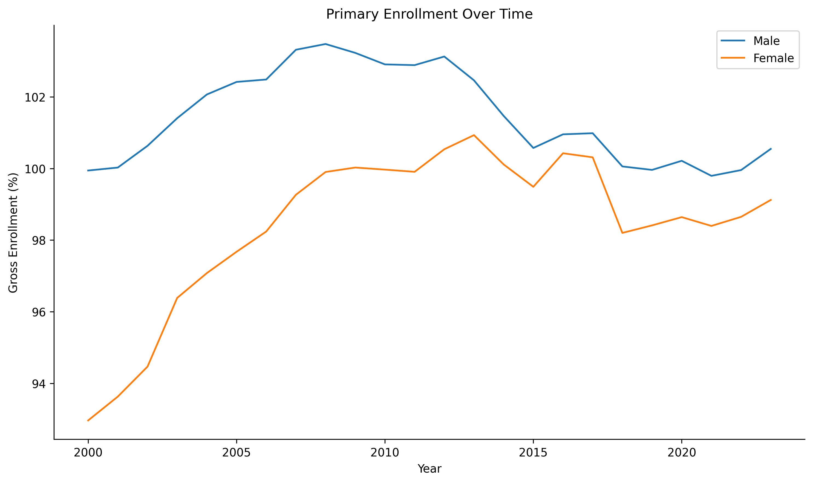

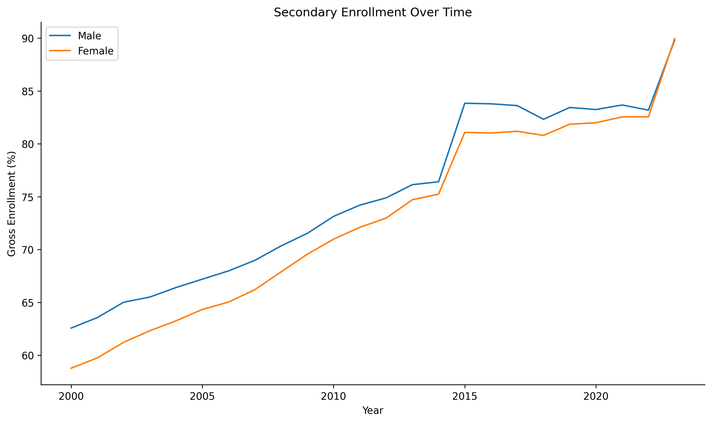

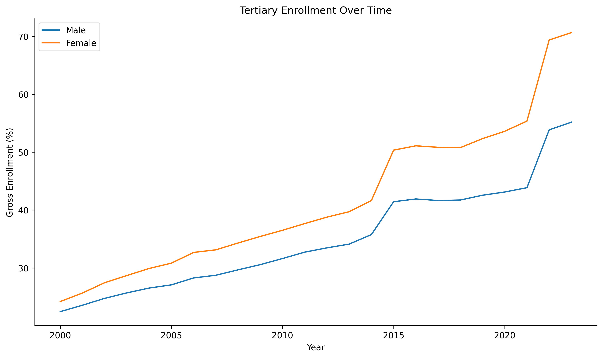

### Gender Gap Trends Over Time

The gender gap is defined as male enrollment minus female enrollment. A positive value indicates higher male enrollment and a negative value indicates higher female enrollment.

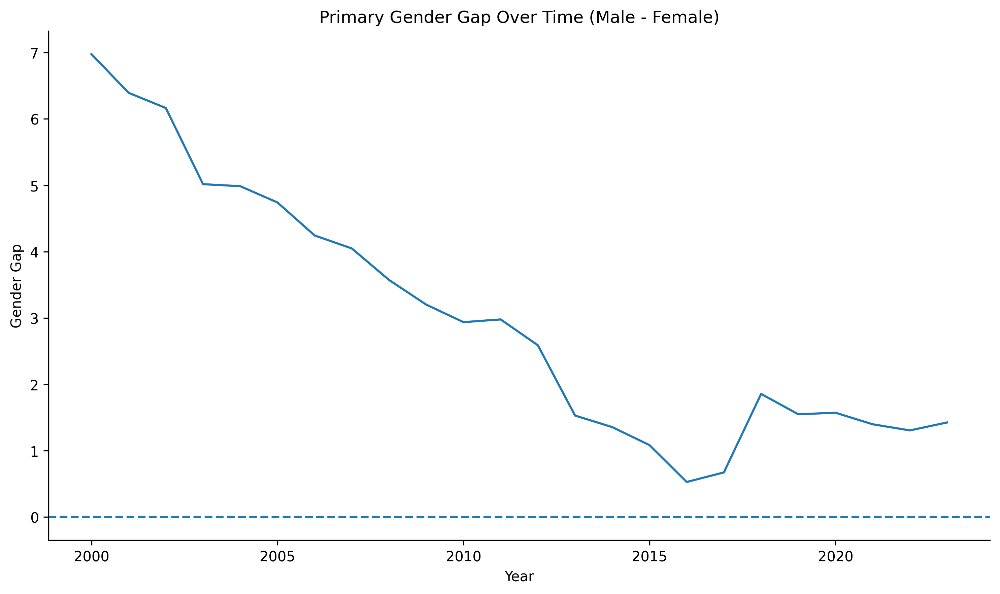

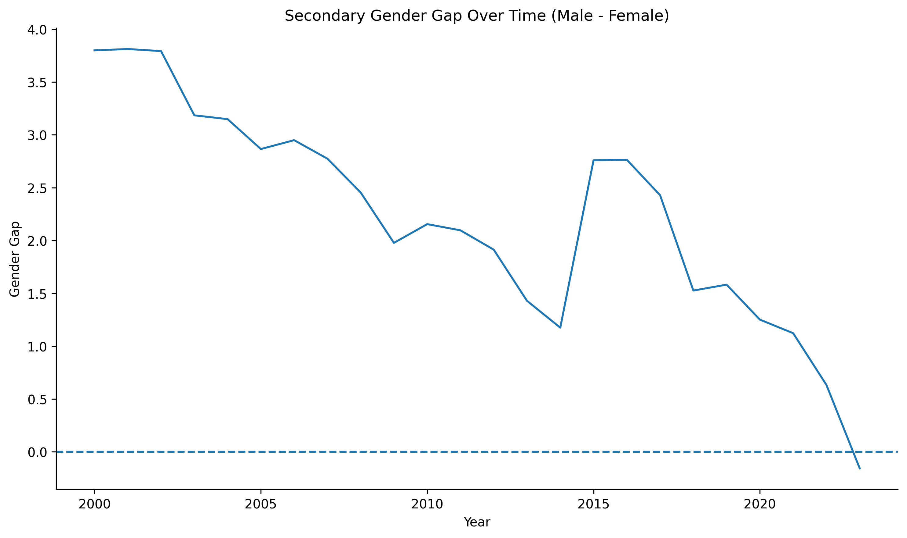

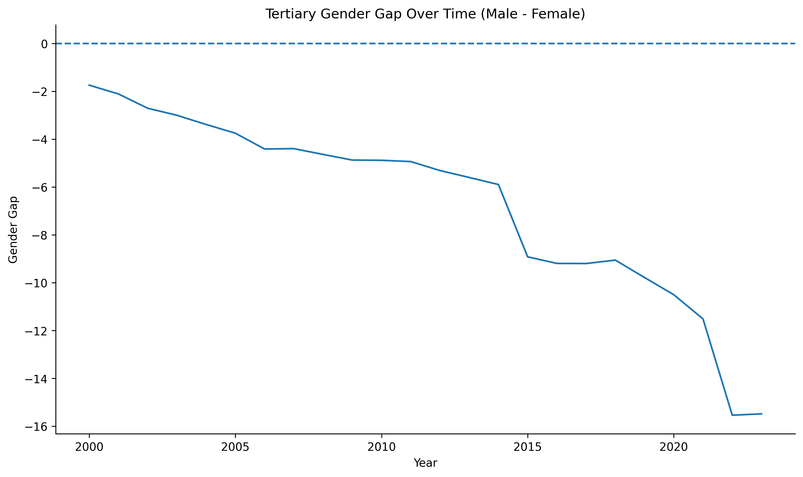

### Enrollment by Education Level

The following figures compare enrollment trends across all three education levels simultaneously, separately for female and male students.

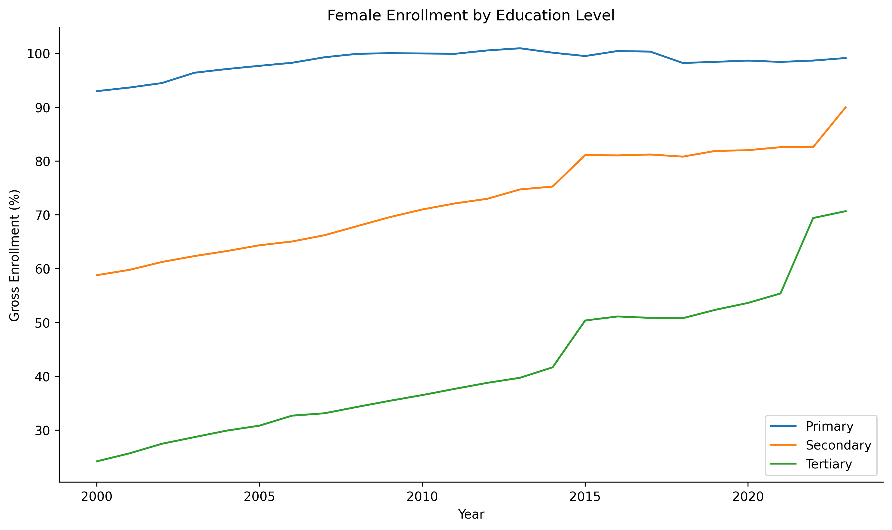

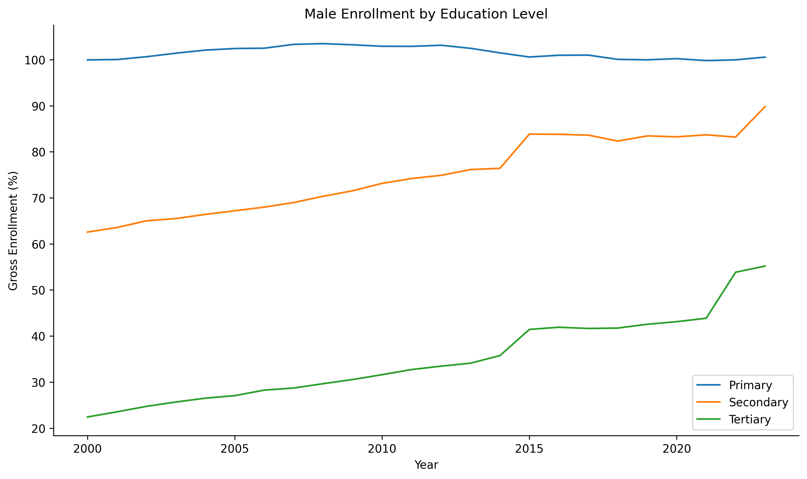

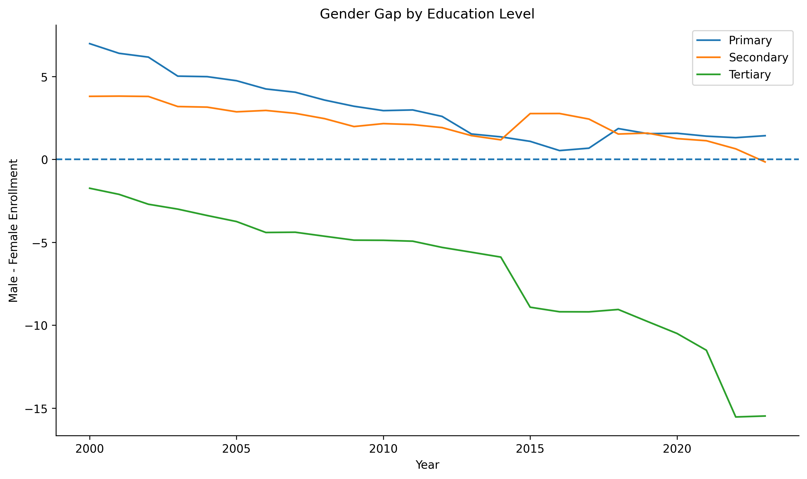

### Regional Breakdown — Tertiary Enrollment

The bar charts below show female tertiary enrollment and the tertiary gender gap broken down by region for the most recent available year.

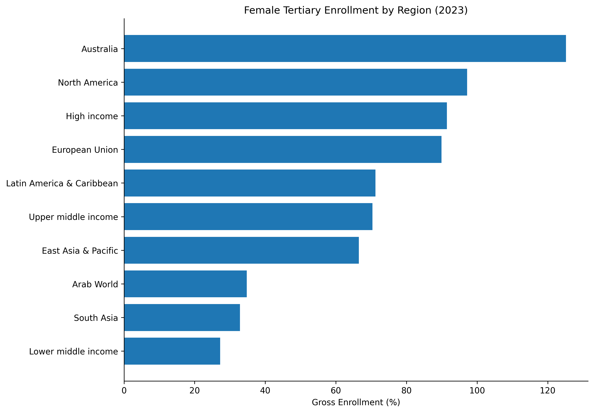

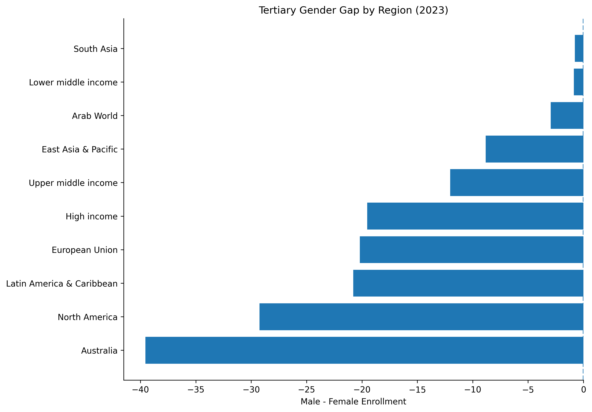

### Linear Trend Models

To assess whether enrollment rates have changed systematically over time, we fit simple linear regression models with year as the predictor for each gender and education level.

```{python}
#| echo: true
#| eval: false

def run_trend_model(df, outcome, label):
    model_df = df.dropna(subset=["year", outcome]).copy()
    yearly = model_df.groupby("year")[outcome].mean().reset_index()
    X = yearly[["year"]]
    y = yearly[outcome]
    model = LinearRegression()
    model.fit(X, y)
    print(label)
    print("Slope:", round(model.coef_[0], 4))
    print("Intercept:", round(model.intercept_, 4))
    print("R^2:", round(model.score(X, y), 4))
    print()

# Female enrollment trends
run_trend_model(primary, "female_enrollment", "Primary female enrollment trend")
run_trend_model(secondary, "female_enrollment", "Secondary female enrollment trend")
run_trend_model(tertiary, "female_enrollment", "Tertiary female enrollment trend")

# Male enrollment trends
run_trend_model(primary, "male_enrollment", "Primary male enrollment trend")
run_trend_model(secondary, "male_enrollment", "Secondary male enrollment trend")
run_trend_model(tertiary, "male_enrollment", "Tertiary male enrollment trend")
```

## RQ2: Trained Teachers and Enrollment

```{python}

```

# Results and Discussion

[Add summary of key findings from RQ1 and RQ2 here once analysis is complete]

# Conclusion

This project analyzed gender disparities in school enrollment and the distribution of trained teachers across global regions and income groups from 2000 to 2023. Using data from the World Bank's WDI database, we found patterns of persistent but evolving gender gaps across education levels, with notable differences between regional and income groupings.

There are certain limitations with our analysis, including the fact that there is missing data for certain years in some of our variables, particularly for the trained teacher indicator. Future work could incorporate country-level data to provide more granular insights, or extend the analysis to include additional indicators such as learning outcomes or government education expenditure.