# Introduction

Introduction
This project examines global education patterns using data from the World Bank's World Development Indicators (WDI), with a focus on school enrollment across primary, secondary, and tertiary levels. The WDI EdStats Query holds around 2,500 internationally comparable education indicators covering access, progression, completion, literacy, teachers, population, and expenditures (World Bank, "Education Statistics"). Rather than analyzing individual countries, the study compares aggregated regional and income-based groupings provided by the World Bank, allowing for a broader and more structured analysis of global education systems. The analysis includes gender-disaggregated enrollment data and measures of trained teachers to provide a multidimensional view of education. 
Education is a key driver of economic development, human capital formation, and long-term growth. Research confirms the positive effects of enrollment rates, average years of schooling, education spending, and education quality on economic growth (Wang et al.). While enrollment rates provide an important measure of access to schooling, they do not fully capture the effectiveness or equity of education systems. Gender differences in enrollment can reveal persistent inequalities in access, while the proportion of trained teachers reflects the quality of education systems. Teacher quality has long been acknowledged as a crucial educational input and a predictor of instructional quality, which in turn leads to better student achievement (Pholphirul). Examining these factors across both regional and income-based groupings allows for a more systematic understanding of how development levels relate to enrollment. 
This analysis is guided by two primary research questions. First, how do male and female enrollment rates differ across global regions and income groups from 2000 to 2023, and how do these differences vary across levels of education? Second, how does the proportion of trained teachers in secondary education relate to enrollment levels across these groupings?

To address these questions, we construct a dataset from multiple WDI education indicators and apply a series of data cleaning and preprocessing steps to ensure consistency across regions, income groups, and years.

# Data Description

The dataset used in this project is drawn from the World Bank's World Development Indicators (WDI), which contains over 1,600 indicators across more than 200 countries and territories from 1960 to 2023. In addition to country-level data, the WDI provides pre-aggregated indicators for regional groupings (e.g., East Asia & Pacific, Europe & Central Asia) and income-based groupings. This project focuses on these aggregated regional and income categories rather than individual countries.

The analysis uses a subset of education-related indicators, including school enrollment rates at the primary, secondary, and tertiary levels, gender-disaggregated enrollment measures, and the proportion of trained teachers. These indicators are selected to capture key dimensions of education systems, including access to schooling, equity across gender, and the quality of instruction.

To ensure consistency and comparability, the dataset is restricted to selected regional and income groupings and to the time period from 2000 to 2023.

## Regions and Income Groups

The following 13 regional and income groupings are included in the analysis:

| Region / Group | Code |
|----------------|------|
| Africa Eastern & Southern | AFE |
| Africa Western & Central | AFW |
| Arab World | ARB |
| Australia | AUS |
| East Asia & Pacific | EAS |
| European Union | EUU |
| Latin America & Caribbean | LCN |
| North America | NAC |
| South Asia | SAS |
| Low income | LIC |
| Lower middle income | LMC |
| Upper middle income | UMC |
| High income | HIC |

## Data Cleaning — Enrollment Data

Enrollment data for primary, secondary, and tertiary levels was downloaded separately for male and female students from the World Bank WDI database. Each file was loaded into Python, filtered to include only the 13 target region/income codes and years 2000–2023, and reshaped from wide format into long format using SQL via SQLite in Python. Male and female tables were then merged on `country_code` and `year` to produce a single merged dataset for each education level. The process was repeated identically for primary, secondary, and tertiary enrollment.

## Data Cleaning — Trained Teacher Data

After assessing the structure of the dataset and the extent of missing values, the data was restricted to observations from 2000 to 2023 and to the selected regional and income-group country codes. The preliminary data file was in wide format and was reshaped into long format with the variables country_name, country_code, year, and trained_teacher using SQLite in Python. The final cleaned file contained 312 country-year observations, of which only 126 had non-missing values for trained_teacher.

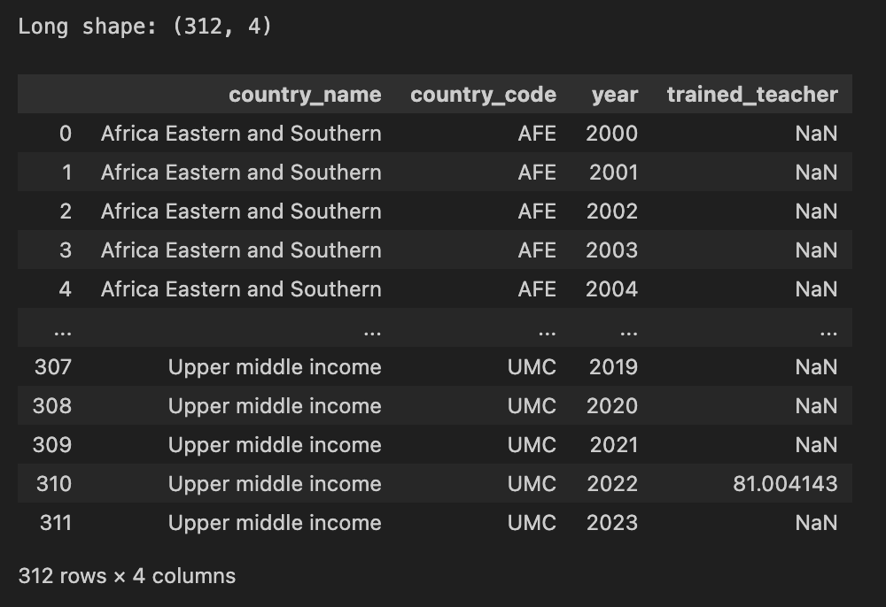


The histogram of trained teacher percentages shows a distribution concentrated mostly between 55 and 100 percent, with heavier clustering toward the upper end. The mean was 78.67 and the median was 80.43, indicating a mild left skew. The time-series plot showed no clear linear trend — the yearly mean declined from the early 2000s into the early 2010s before recovering in later years. Interestingly, the median falls below the mean in the late 2000s before rising above it around 2015, reflecting a changing distribution of trained teacher percentages over time.

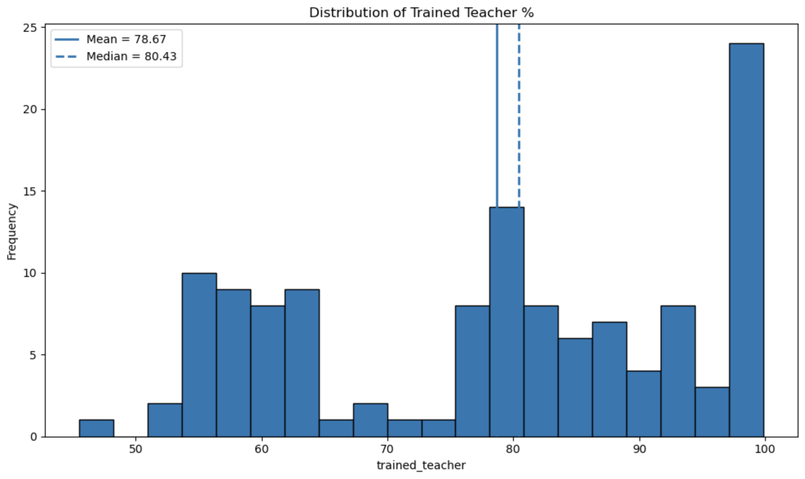

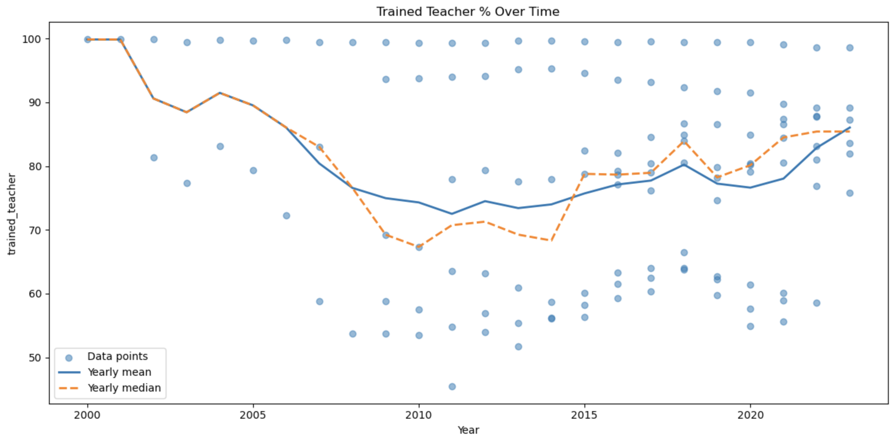

# Data Analysis

## SQL Exploratory Data Analysis

Before conducting the full analysis, we used SQL queries via SQLite in Python to compute descriptive statistics across all three education levels combined.

The SQL queries reveal clear differences across education levels. At the primary level, average male enrollment (101.45%) slightly exceeds female enrollment (98.45%), producing a small average gender gap of -3.01 percentage points (female minus male). At the secondary level, average male enrollment (75.21%) again slightly exceeds female (72.99%), with an average gap of -2.22 points. At the tertiary level, the pattern reverses — female enrollment (41.57%) substantially exceeds male enrollment (34.91%), with an average gap of +6.65 percentage points in favor of females.

### Enrollment Percentage Change from 2000 to 2023

We also computed the percentage change in male and female enrollment from 2000 to 2023 for each region and education level using SQL.

At the primary level, the largest female enrollment gains occurred in low-income regions — Low income (LIC) saw a 54.01% increase in female enrollment compared to 29.87% for males. Africa Eastern & Southern (AFE) saw a 34.71% female increase versus 22.20% for males, and Africa Western & Central (AFW) saw a 24.95% female increase versus only 3.26% for males. High-income regions saw small declines, consistent with already near-universal enrollment.

At the secondary level, AFW saw a 145.51% increase in female secondary enrollment versus 81.01% for males — the fastest female growth of any region. South Asia (SAS) saw a 93.69% female increase versus 43.33% for males. High-income regions saw much smaller gains of around 2–5% for both genders.

At the tertiary level, growth was dramatic across all regions. Upper middle income (UMC) saw female enrollment grow by 365.86% compared to 273.87% for males. South Asia saw female tertiary enrollment grow by 359.01% versus 187.65% for males. Even high-income regions saw substantial female tertiary growth — North America grew 27.16% for females versus 17.52% for males. These results confirm that female tertiary enrollment has been growing faster than male across virtually every region.

## RQ1: Male vs. Female Enrollment Across Regions and Education Levels

To address the first research question, we analyzed gender-disaggregated enrollment rates across primary, secondary, and tertiary education from 2000 to 2023. A gender gap variable was computed as male enrollment minus female enrollment, where positive values indicate higher male enrollment and negative values indicate higher female enrollment.

### Primary Enrollment

At the primary level, male gross enrollment has consistently exceeded female enrollment, though the gap has narrowed significantly. In 2000, the gender gap was approximately 7 percentage points, with male enrollment near 100% and female enrollment around 93%. The gap declined steadily through 2016, reaching a low of about 0.6 percentage points, before stabilizing at roughly 1.5 points by 2023.

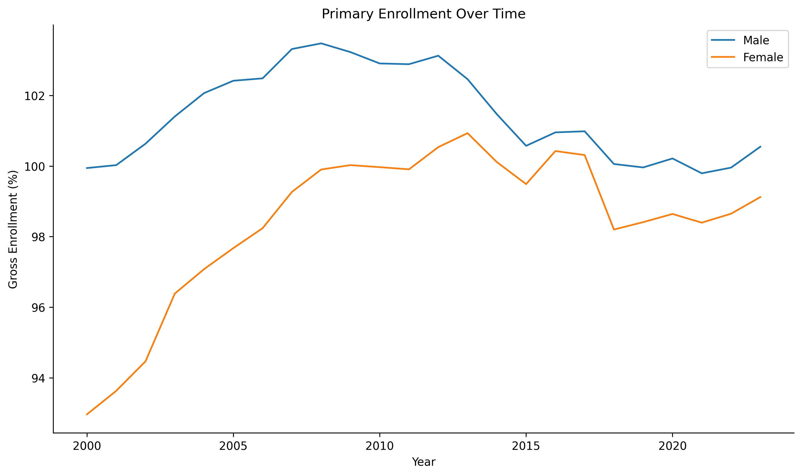

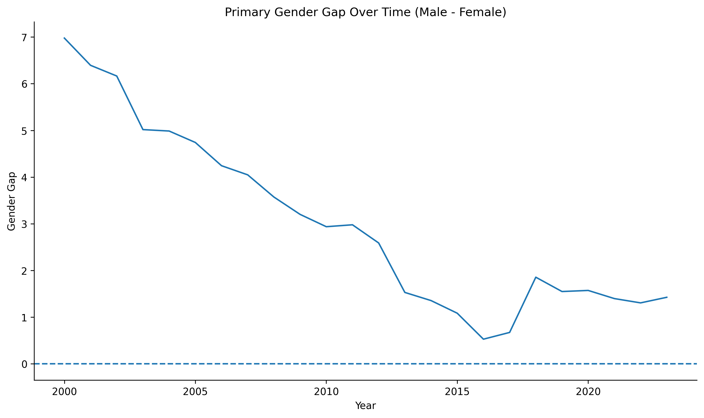

### Secondary Enrollment

Secondary enrollment shows strong growth for both genders. Male enrollment rose from approximately 63% in 2000 to around 83% by 2023, while female enrollment grew from roughly 59% to nearly 90%. The gender gap started at about 3.8 percentage points in 2000 and declined steadily, dipping below zero by 2023 — meaning female secondary enrollment has now slightly surpassed male enrollment globally.

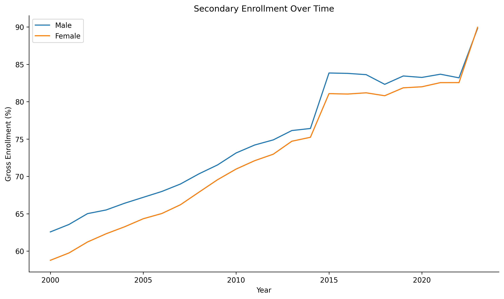

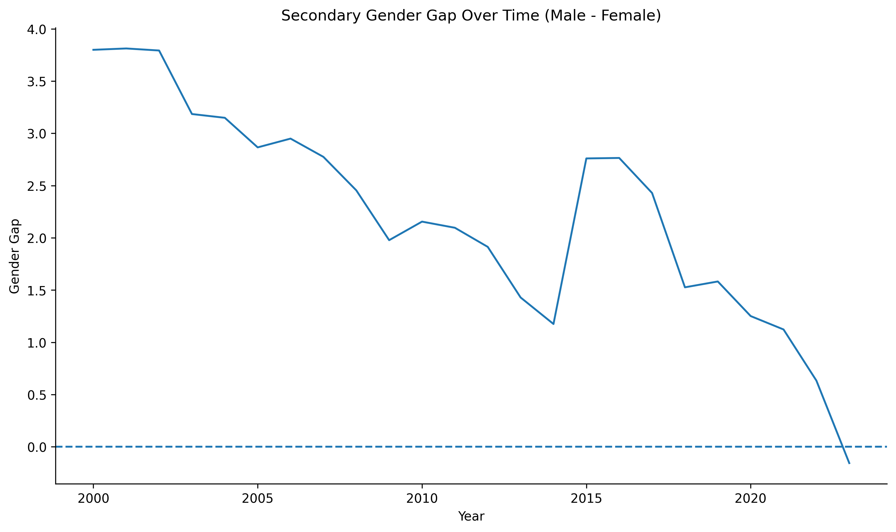

### Tertiary Enrollment

At the tertiary level, female enrollment has exceeded male enrollment throughout the entire study period and the gap has been widening rapidly. In 2000, the gap was already about -2 percentage points (females ahead), with both genders at around 23–25%. By 2023, female enrollment reached approximately 71% compared to male enrollment of around 56%, with the gap widening to nearly -16 percentage points.

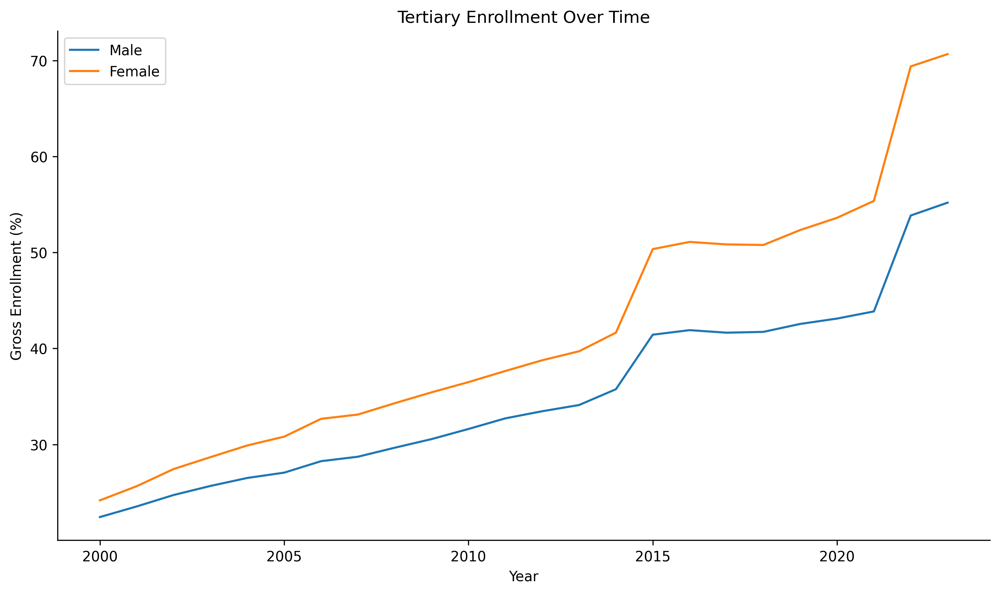

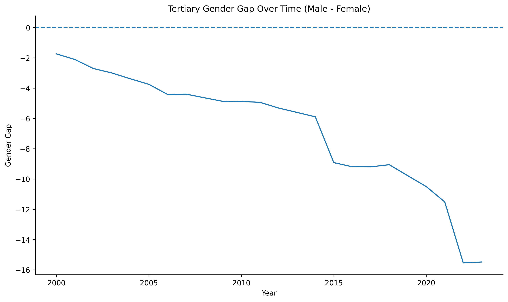

### Gender Gap Across All Education Levels

When comparing all three levels together, primary and secondary gaps started positive and have converged toward zero, while the tertiary gap has accelerated downward to about -15 percentage points by 2023. This suggests that while gender disparities in basic education are narrowing, a new and growing gap has emerged at the tertiary level in favor of women.

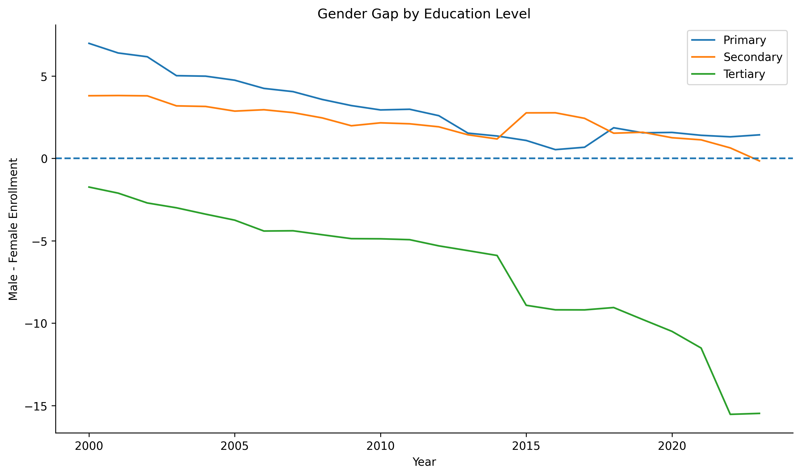

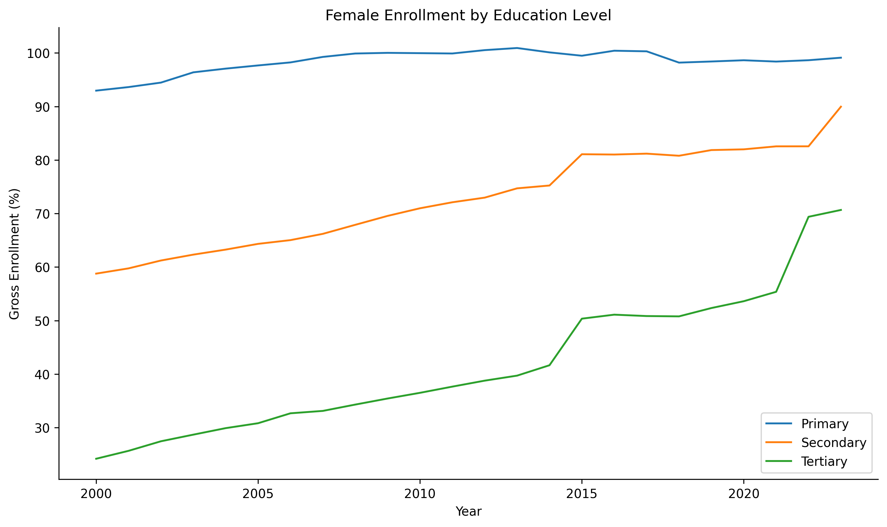

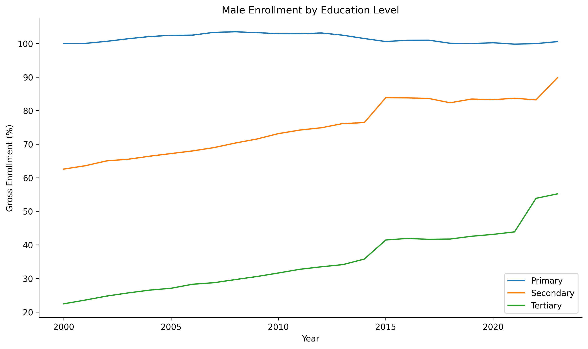

### Regional Breakdown — Tertiary Enrollment (2023)

For female tertiary enrollment in 2023, Australia leads at over 125%, followed by North America (~97%), High income (~91%), and the European Union (~89%). South Asia (~33%), Arab World (~35%), and Lower middle income (~27%) have the lowest female tertiary enrollment. For the tertiary gender gap in 2023, nearly all regions show negative values. Australia has the largest female advantage at about -40 percentage points, followed by North America (~-30) and Latin America & Caribbean (~-19). South Asia and Lower middle income are the only groups near zero.

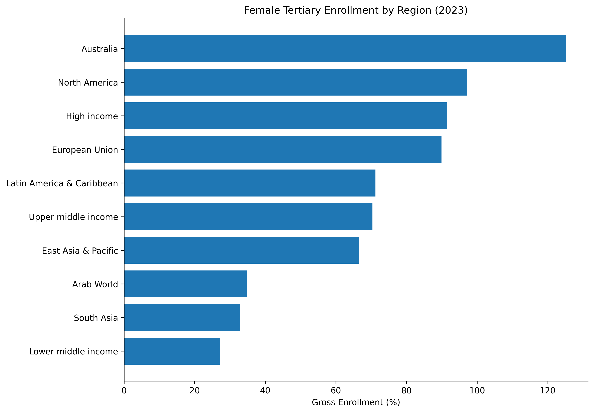

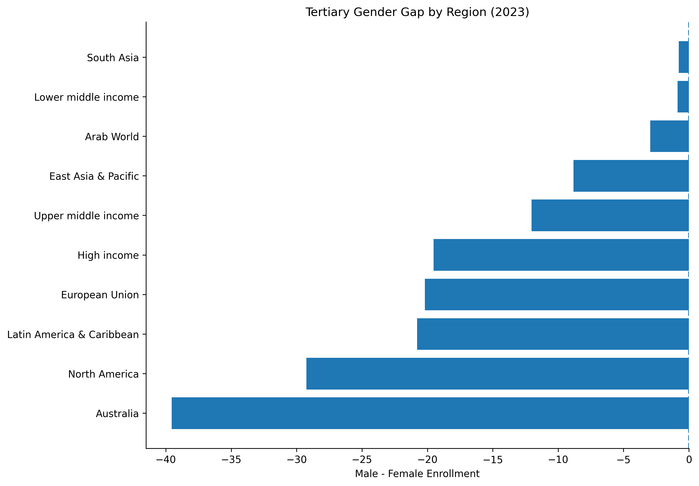

### Linear Trend Models

To assess whether enrollment rates have changed systematically over time, we fit simple linear regression models with year as the predictor for each gender and education level. These models confirm the visual trends — female enrollment shows a positive slope across all three levels, with the steepest increase at the tertiary level. Male enrollment trends are flatter at the primary level and positive at secondary and tertiary, though female slopes are consistently larger, confirming that female enrollment has been growing faster than male enrollment across all education levels.

```{python}
#| echo: true
#| eval: false

def run_trend_model(df, outcome, label):
    model_df = df.dropna(subset=["year", outcome]).copy()
    yearly = model_df.groupby("year")[outcome].mean().reset_index()
    X = yearly[["year"]]
    y = yearly[outcome]
    model = LinearRegression()
    model.fit(X, y)
    print(label)
    print("Slope:", round(model.coef_[0], 4))
    print("Intercept:", round(model.intercept_, 4))
    print("R^2:", round(model.score(X, y), 4))
    print()

run_trend_model(primary, "female_enrollment", "Primary female enrollment trend")
run_trend_model(secondary, "female_enrollment", "Secondary female enrollment trend")
run_trend_model(tertiary, "female_enrollment", "Tertiary female enrollment trend")
run_trend_model(primary, "male_enrollment", "Primary male enrollment trend")
run_trend_model(secondary, "male_enrollment", "Secondary male enrollment trend")
run_trend_model(tertiary, "male_enrollment", "Tertiary male enrollment trend")
```

## RQ2: Trained Teachers and Secondary Enrollment

To address the second research question, we merged the cleaned trained teacher dataset with the secondary enrollment data on country_code and year, then examined the relationship between the percentage of trained teachers and secondary enrollment rates.

### Relationship Between Trained Teachers and Enrollment

The scatter plot below shows a clear positive relationship between the percentage of trained teachers and average secondary enrollment. Regions with higher proportions of trained teachers tend to have substantially higher secondary enrollment rates. A linear regression model confirms this, with a slope of 1.54, an intercept of -51.17, and an R² of 0.709 — meaning trained teacher percentage explains approximately 71% of the variation in average secondary enrollment across regions and years. The correlation between trained teacher percentage and average enrollment is 0.849, indicating a strong positive association.

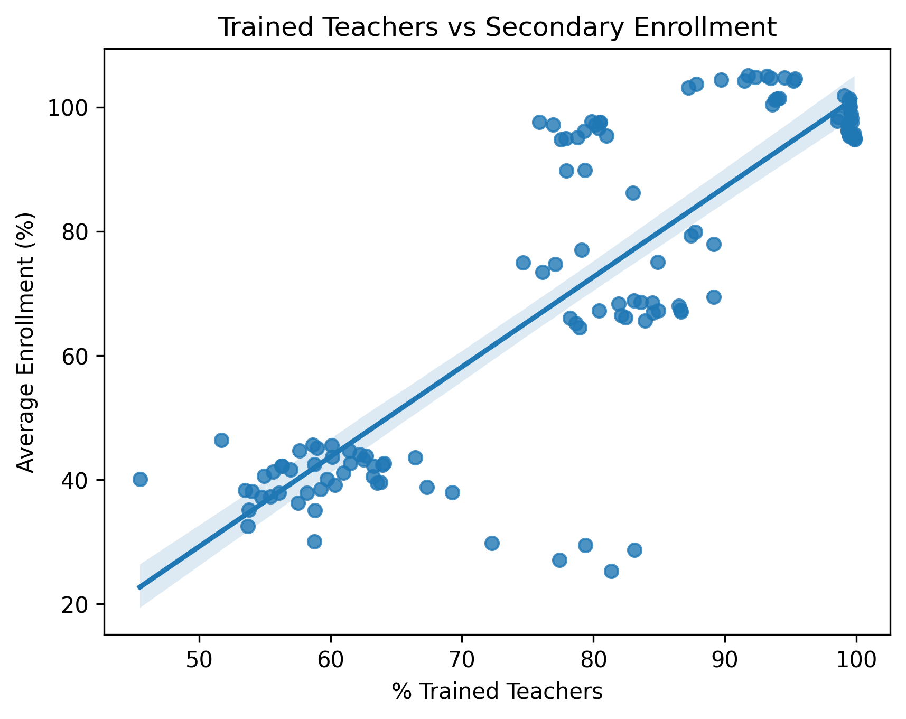

### Trends Over Time

The time-series plot shows that trained teacher percentages and average secondary enrollment have moved in opposite directions for much of the study period. Trained teacher percentages started near 100% in 2000 and declined to around 75% by 2010 before partially recovering. Average secondary enrollment, by contrast, rose steadily from around 61% in 2000 to approximately 90% by 2023. The two lines converge around 2010–2012, after which enrollment continues rising while trained teacher percentages stabilize. This divergence suggests that enrollment growth has not been driven primarily by increases in teacher training rates, and that other factors — such as infrastructure investment, policy changes, and demographic shifts — have also contributed.

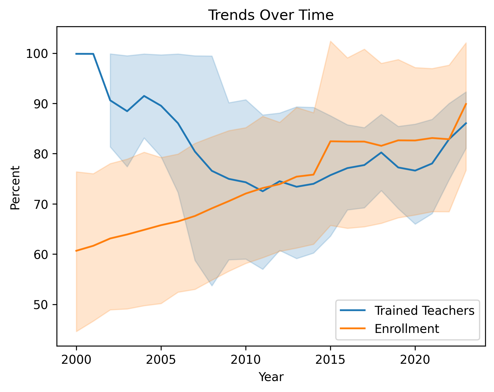

### Gender Comparison

When comparing the relationship separately for male and female enrollment, both show a strong positive association with trained teacher percentage. The male regression line sits slightly above the female line at lower trained teacher percentages, suggesting that in regions where a smaller share of teachers are trained, male enrollment tends to be somewhat higher than female enrollment. However, the two lines converge at higher trained teacher percentages, suggesting that as teacher quality improves, the gender gap in secondary enrollment narrows.

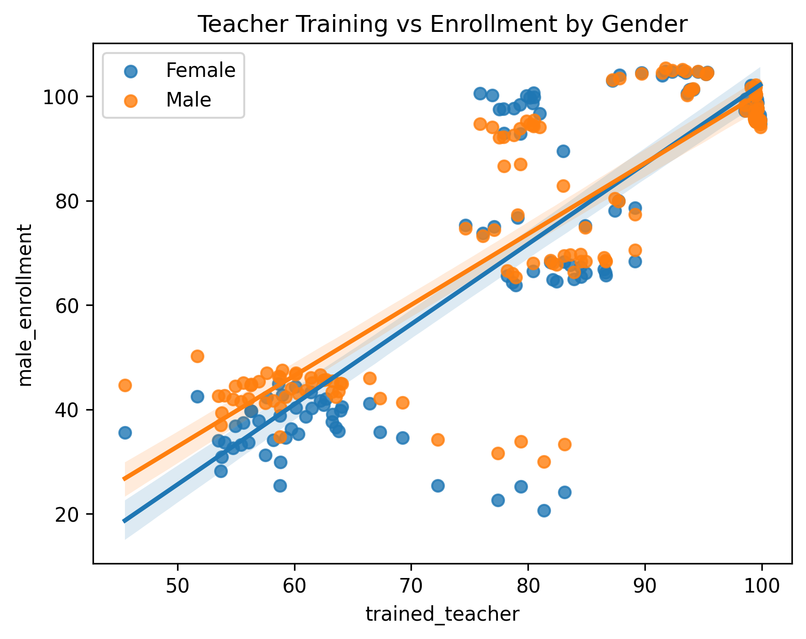

# Results and Discussion

The analysis reveals two key findings. First, gender gaps in primary and secondary enrollment have narrowed substantially from 2000 to 2023, with the male advantage declining toward zero or reversing entirely by 2023. At the tertiary level, female enrollment has consistently exceeded male enrollment throughout the study period, and this gap has widened dramatically to approximately -16 percentage points by 2023. The fastest gains in female enrollment relative to male occurred in lower-income regions — particularly Africa Western & Central (+145.51% female secondary growth) and South Asia (+359.01% female tertiary growth) — suggesting meaningful progress toward gender parity in these regions.

Second, the proportion of trained teachers in secondary schools is strongly associated with secondary enrollment levels, with a correlation of 0.849 and an R² of 0.709. The gender comparison further suggests that higher trained teacher shares are associated with a narrowing of the secondary gender gap, as male and female enrollment rates converge at higher levels of teacher training. However, the time-series analysis shows that enrollment has grown even as trained teacher percentages declined in some periods, indicating that enrollment is driven by multiple factors beyond teacher training alone.

There are limitations to note. The trained teacher data has substantial missing values, particularly for lower-income regions, which limits the scope of the RQ2 analysis. As mentioned previously, only 126 of 312 country-year observation were populated. Additionally, because the analysis uses aggregated regional and income-group data rather than country-level data, within-region variation is obscured.

# Conclusion

This project analyzed gender disparities in school enrollment and the relationship between trained teacher percentages and enrollment across global regions and income groups from 2000 to 2023. We found that gender gaps in primary and secondary enrollment have narrowed substantially, while at the tertiary level, female enrollment has consistently exceeded male enrollment and the gap has widened to nearly -16 percentage points by 2023. The analysis also found a strong positive association between trained teacher percentage and secondary enrollment levels, with an R² of 0.709, and evidence that higher teacher training rates are associated with a narrowing of the secondary gender gap. Future work could incorporate country-level data for more granular insights, or extend the analysis to include additional indicators such as learning outcomes or government education expenditure. It would also be valuable to delve into the effects of specific programs designed to increase enrollment to explore how they can be improved.


# Citations
World Bank. "Education Statistics — All Indicators." DataBank, World Bank Group, https://databank.worldbank.org/source/education-statistics-%5E-all-indicators.
Wang, Feng, et al. "An Empirical Analysis of the Impact of Higher Education on Economic Growth: The Case of China." PLOS ONE, 2022, https://pmc.ncbi.nlm.nih.gov/articles/PMC9435527/.
Pholphirul, Piriya. "Teacher Shortages and Educational Outcomes in Developing Countries: Empirical Evidence from PISA-Thailand." Cogent Education, 2023, https://www.tandfonline.com/doi/full/10.1080/2331186X.2023.2243126.